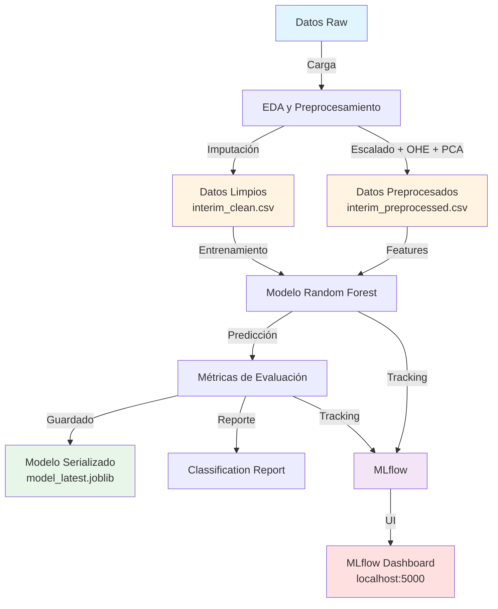

# Diagrama de Arquitectura del Pipeline MLOps

## Proyecto: Student Performance on an Entrance Examination
### Equipo 56 - Fase 2

---

## 1. Arquitectura General del Sistema

```
┌─────────────────────────────────────────────────────────────────────────┐
│                         REPOSITORIO GITHUB                               │
│                                                                         │
│  proyecto_mlops_equipo_56/                                              │
│  ├── data/                                                               │
│  │   ├── raw/              (CSVs originales de UCI)                     │
│  │   └── interim/          (✅ Versionado con DVC)                      │
│  │       ├── *_clean.csv                                               │
│  │       └── *_preprocessed.csv                                        │
│  │                                                                      │
│  ├── mlops/               (Módulos reutilizables)                       │
│  │   ├── config.py        → Rutas y constantes                          │
│  │   ├── dataset.py       → Carga/guardado de datos                     │
│  │   ├── features.py      → Preprocesamiento                            │
│  │   ├── plots.py         → Visualizaciones estáticas                   │
│  │   └── report_html.py   → Reportes interactivos                       │
│  │                                                                      │
│  ├── train/               (Scripts de entrenamiento)                    │
│  │   ├── train_model_sre.py          → Modelo principal (RF)            │
│  │   └── train_multiple_models.py    → Comparación multi-modelo        │
│  │                                                                      │
│  ├── models/              ✅ Versionado con DVC                          │
│  ├── reports/             ✅ Visualizaciones y métricas                  │
│  ├── mlruns/              ✅ Tracking de MLflow                          │
│  │                                                                      │
│  ├── dvc.yaml             → Definición del pipeline                     │
│  ├── requirements.txt     → Dependencias reproducibles                  │
│  └── README.md            → Documentación                                │
└─────────────────────────────────────────────────────────────────────────┘
```

---

## 2. Pipeline de Procesamiento (DVC)



---

## 3. Flujo de Trabajo Detallado

### Fase 1: Exploración y Preparación (EDA)

```
┌──────────────────────────────────────────────────────────────────┐
│  EJECUCIÓN: python run_eda.py                                    │
├──────────────────────────────────────────────────────────────────┤
│                                                                  │
│  1. Carga de Datos                                               │
│     mlops/dataset.py                                             │
│     └─→ data/raw/student_entry_performance_modified.csv         │
│                                                                  │
│  2. Tipificación y Normalización                                 │
│     mlops/features.py                                            │
│     ├─→ Detección automática num/cat                             │
│     ├─→ Limpieza de texto (normalización)                        │
│     └─→ Imputación (mediana/moda)                                │
│                                                                  │
│  3. Visualizaciones                                              │
│     mlops/plots.py                                               │
│     ├─→ Distribución de target                                  │
│     ├─→ Missingness patterns                                    │
│     ├─→ Análisis categórico                                     │
│     └─→ Análisis numérico                                       │
│                                                                  │
│  4. Preprocesamiento Avanzado                                    │
│     mlops/features.py                                            │
│     ├─→ StandardScaler (numéricas)                              │
│     ├─→ OneHotEncoder (categóricas)                             │
│     └─→ PCA (3 componentes)                                     │
│                                                                  │
│  5. Guardado                                                      │
│     ├─→ data/interim/student_interim_clean.csv                  │
│     └─→ data/interim/student_interim_preprocessed.csv           │
│                                                                  │
└──────────────────────────────────────────────────────────────────┘
                           ↓ (DVC tracking)
                   dvc.yaml stage: preprocessing
```

### Fase 2: Entrenamiento y Evaluación

```
┌──────────────────────────────────────────────────────────────────┐
│  EJECUCIÓN: python train/train_model_sre.py                     │
│           o python train/train_multiple_models.py               │
├──────────────────────────────────────────────────────────────────┤
│                                                                  │
│  1. Carga de Datos Preprocesados                                 │
│     X = preprocessed.csv                                         │
│     y = clean.csv["Performance"]                                 │
│                                                                  │
│  2. División Train/Test                                          │
│     train_test_split(                                            │
│       test_size=0.2,                                             │
│       random_state=42,                                           │
│       stratify=y                                                 │
│     )                                                            │
│                                                                  │
│  3. Configuración de Modelos                                     │
│     [RandomForest, XGBoost, LogisticRegression, ...]            │
│                                                                  │
│  4. Optimización de Hiperparámetros                              │
│     GridSearchCV(                                                │
│       model,                                                     │
│       param_grid,                                                │
│       cv=5,                                                      │
│       scoring='accuracy'                                         │
│     )                                                            │
│                                                                  │
│  5. Entrenamiento                                                │
│     model.fit(X_train, y_train)                                  │
│                                                                  │
│  6. Evaluación                                                   │
│     ├─→ y_pred = model.predict(X_test)                          │
│     ├─→ accuracy, precision, recall, f1                         │
│     ├─→ Confusion matrix                                        │
│     └─→ Classification report                                   │
│                                                                  │
│  7. Tracking con MLflow                                          │
│     mlflow.start_run()                                           │
│     ├─→ log_params(hiperparámetros)                             │
│     ├─→ log_metrics(accuracy, f1, ...)                          │
│     ├─→ log_model(modelo)                                       │
│     └─→ log_artifacts(reportes, figuras)                        │
│                                                                  │
│  8. Persistencia                                                 │
│     ├─→ models/model_latest.joblib                              │
│     └─→ reports/classification_report_*.txt                     │
│                                                                  │
└──────────────────────────────────────────────────────────────────┘
                           ↓ (DVC tracking)
                   dvc.yaml stage: training
```

---

## 4. Herramientas y Versionado

### 4.1 Control de Versiones Multi-Capa

```
┌──────────────────────────────────────────────────────────────┐
│                     VERSIONADO                                │
├──────────────────────────────────────────────────────────────┤
│                                                              │
│  ┌────────────┐      ┌────────────┐      ┌────────────┐   │
│  │    Git     │      │    DVC     │      │   MLflow   │   │
│  ├────────────┤      ├────────────┤      ├────────────┤   │
│  │ • Código   │      │ • Datos    │      │ • Modelos  │   │
│  │ • Config   │      │ • Artefactos│     │ • Runs     │   │
│  │ • Docs     │      │ • Pipeline │      │ • Métricas │   │
│  │            │      │            │      │            │   │
│  │ GitHub     │      │ Local FS   │      │ UI + API   │   │
│  └────────────┘      └────────────┘      └────────────┘   │
│                                                              │
└──────────────────────────────────────────────────────────────┘
```

### 4.2 Reproducibilidad

```yaml
# requirements.txt
Python 3.12.6
numpy==1.26.4
pandas==2.2.3
scikit-learn==1.5.2
mlflow==2.15.1
dvc[all]==3.54.0
plotly==6.3.1

# dvc.yaml
stages:
  preprocessing:
    cmd: python run_eda.py
    deps: [mlops/*, run_eda.py]
    outs: [data/interim/*]
  
  training:
    cmd: python train/train_model_sre.py
    deps: [data/interim/*]
    outs: [models/*, reports/*]

# SEED en todos los scripts
RANDOM_STATE = 42
```

---

## 5. Roles y Responsabilidades

```
┌──────────────────────────────────────────────────────────────────┐
│                     COLABORACIÓN POR ROLES                        │
├──────────────────────────────────────────────────────────────────┤
│                                                                  │
│  🔧 Data Engineer (Michelle)                                     │
│     └─→ Pipeline de preprocesamiento                             │
│         • Carga y limpieza de datos                              │
│         • Transformaciones automáticas                           │
│         • Integración con DVC                                    │
│                                                                  │
│  🧠 Data Scientist (Erik)                                        │
│     └─→ Análisis y visualización                                 │
│         • EDA comprehensivo                                      │
│         • Reportes HTML interactivos                             │
│         • Comparación de modelos                                 │
│         • Documentación técnica                                  │
│                                                                  │
│  🧩 ML Engineer (Anuar)                                          │
│     └─→ Modelado y tracking                                      │
│         • Configuración de modelos                               │
│         • Optimización de hiperparámetros                        │
│         • MLflow setup y registro                                │
│         • Model Registry                                         │
│                                                                  │
│  💻 Software Engineer (German)                                   │
│     └─→ Estructura y refactor                                    │
│         • Organización modular                                   │
│         • Mejores prácticas POO                                  │
│         • Cookiecutter compliance                                │
│                                                                  │
│  ⚙️  SRE (Neri)                                                 │
│     └─→ Reproducibilidad y automatización                        │
│         • Entorno virtual                                        │
│         • DVC pipeline                                           │
│         • Validación de reproducibilidad                         │
│         • Scripts de automatización                              │
│                                                                  │
└──────────────────────────────────────────────────────────────────┘
```

---

## 6. Comandos de Ejecución

### Pipeline Completo (Reproducible)

```bash
# Opción 1: Ejecución manual paso a paso
python run_eda.py                          # Fase 1: EDA y preprocesamiento
python train/train_model_sre.py            # Fase 2: Entrenamiento único
python train/train_multiple_models.py      # Fase 3: Comparación multi-modelo
python run_reports.py --type eda           # Fase 4: Reportes interactivos

# Opción 2: Pipeline automatizado con DVC
dvc repro                                   # Ejecuta todo el pipeline

# Opción 3: Visualización y monitoreo
python run_mlflow.py                       # Abre MLflow UI
# Navegador: http://127.0.0.1:5000
```

### Verificación de Estado

```bash
# Estado del pipeline
dvc status                                  # Cambios pendientes
dvc dag                                     # Diagrama de dependencias

# Estado de Git
git status                                  # Código no versionado
git log --oneline                           # Historial

# Estado de MLflow
mlflow ui                                   # Interfaz de tracking
```

---

## 7. Flujo de Datos Simplificado

```
INPUT:  data/raw/student_entry_performance_modified.csv
        │
        ├─→ mlops/dataset.py (carga)
        │   │
        │   ├─→ mlops/features.py (tipificación)
        │   │   │
        │   │   ├─→ mlops/plots.py (EDA visual)
        │   │   │   └─→ reports/figures/
        │   │   │
        │   │   └─→ preprocess_advanced()
        │   │       ├─→ StandardScaler
        │   │       ├─→ OneHotEncoder
        │   │       └─→ PCA
        │   │
        │   └─→ data/interim/
        │       ├─→ student_interim_clean.csv        ← DVC tracked
        │       └─→ student_interim_preprocessed.csv ← DVC tracked
        │
        ├─→ train/train_model_sre.py
        │   │
        │   ├─→ train_test_split()
        │   │
        │   ├─→ RandomForestClassifier.fit()
        │   │   └─→ metrics: accuracy, f1, ...
        │   │
        │   ├─→ mlflow.start_run()
        │   │   ├─→ log_params()
        │   │   ├─→ log_metrics()
        │   │   ├─→ log_model()
        │   │   └─→ log_artifacts()
        │   │
        │   └─→ models/
        │       ├─→ model_latest.joblib              ← DVC tracked
        │       └─→ reports/classification_*.txt     ← Git tracked
        │
        └─→ OUTPUT: Modelo entrenado + Reportes + Métricas
        
MLFLOW UI: http://127.0.0.1:5000
          ├─→ Experimentos
          ├─→ Comparación de modelos
          ├─→ Artefactos
          └─→ Visualizaciones
```

---

## 8. Decisiones de Arquitectura

### 8.1 ¿Por qué esta estructura?

✅ **Modularidad**: Separación clara de responsabilidades (EDA, entrenamiento, visualización)  
✅ **Reproducibilidad**: DVC + MLflow garantizan trazabilidad total  
✅ **Escalabilidad**: Fácil agregar nuevos modelos o features  
✅ **Colaboración**: Roles bien definidos y código compartido  
✅ **MLOps**: Best practices (versionado, testing, CI/CD ready)

### 8.2 Mejoras Futuras (Fase 3)

- 🔄 **CI/CD**: GitHub Actions para automatización
- 🐳 **Docker**: Contenedores para despliegue
- 🚀 **API**: FastAPI para inferencia en producción
- 📊 **Monitoreo**: Prometheus + Grafana
- 🔍 **A/B Testing**: Comparación de versiones de modelos
- 📈 **AutoML**: Integración con Hyperopt/Optuna
- 🌐 **Cloud**: Despliegue en AWS/GCP/Azure

---

**Fin del Documento de Arquitectura**

